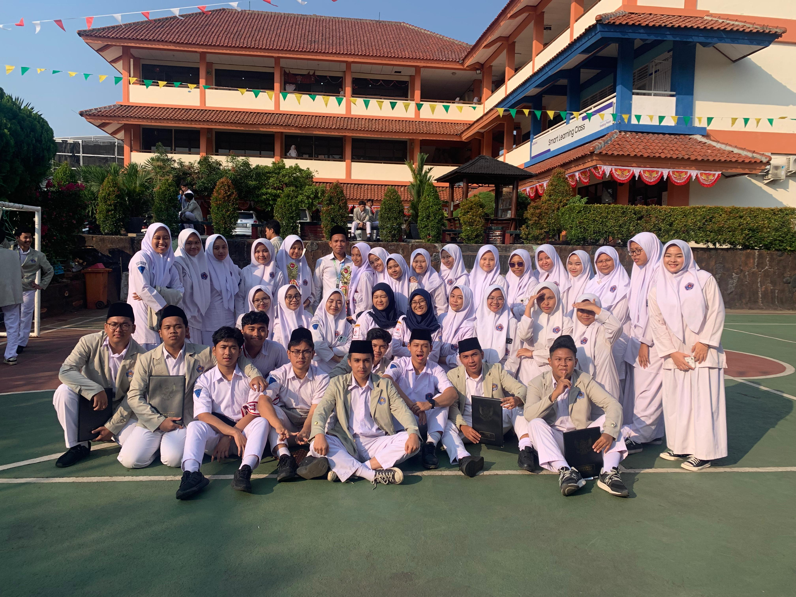
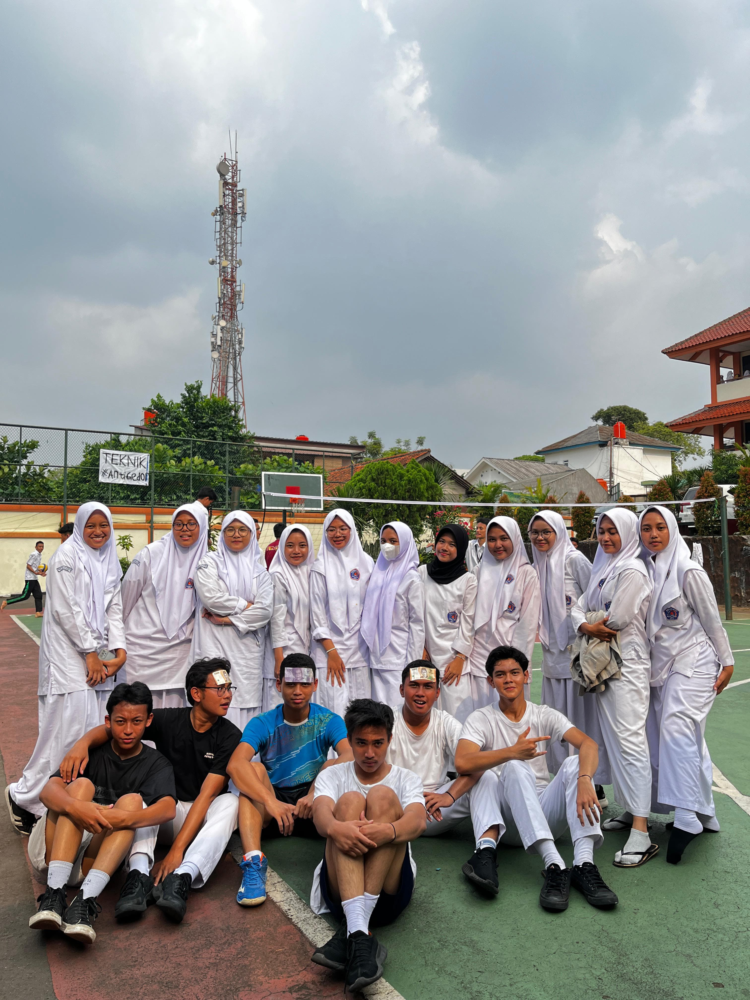
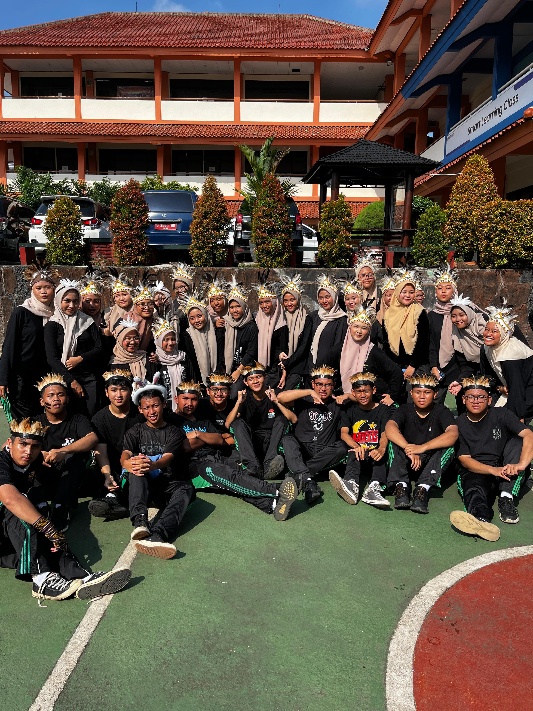
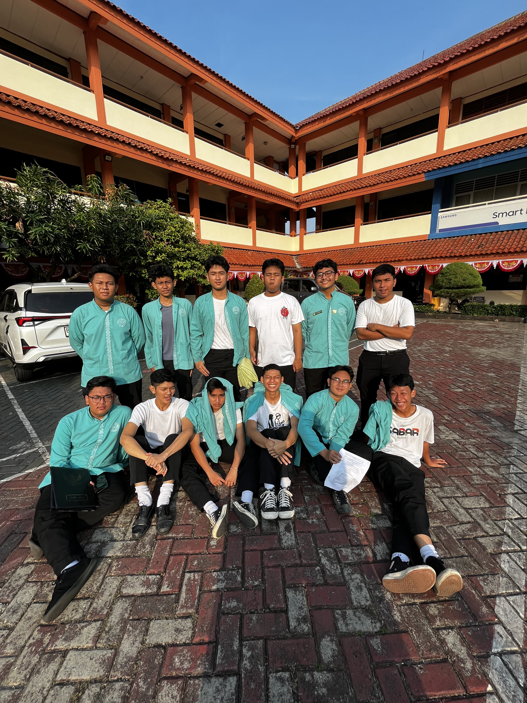
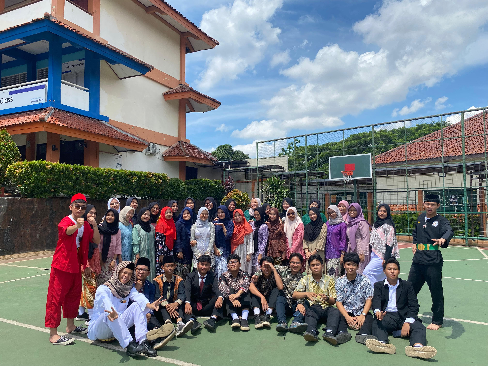
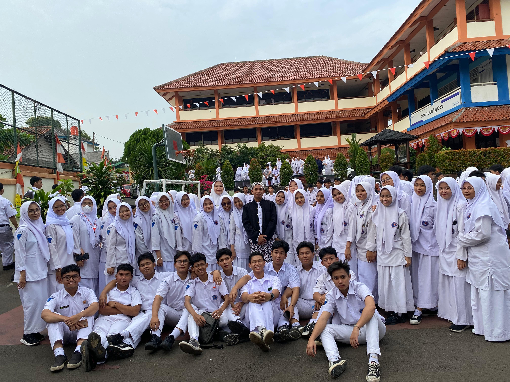
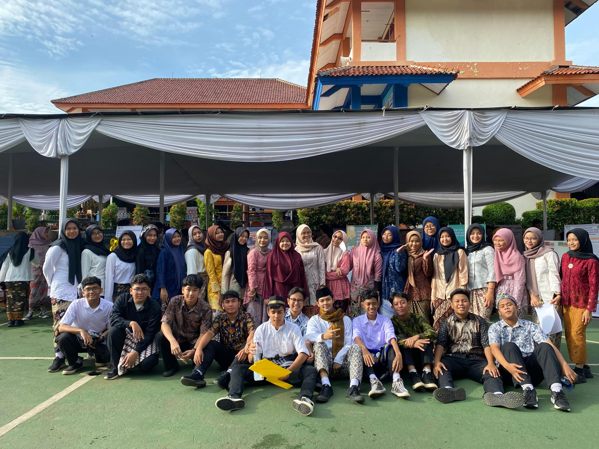

<!DOCTYPE html>
<html lang="id">
<head>
    <meta charset="UTF-8">
    <meta name="viewport" content="width=device-width, initial-scale=1.0">
    <title>Kenangan Kelas</title>
    
</head>
<body>

    <header>
        <h1>Ebitblas</h1>
    </header>

    
    <nav>
        <a href="#home">Home</a>
        <a href="#memories" id="memories-link">Memories</a>
        <a href="#struktur">Struktur</a>
        <a href="#jadwal">Jadwal</a>
        <a href="#about-us">About Us</a>
        <a href="#contact">Contact</a>
    </nav>
 
   

    <!-- Slideshow -->
    

        

            

        

        <a class="prev" onclick="changeSlide(-1)">&#10094;</a>
        <a class="next" onclick="changeSlide(1)">&#10095;</a>
    

    <!-- Memories Section -->
    <section id="memories">
        

            <h2>Memories</h2>
            
Berikut adalah kenangan-kenangan indah kita selama di kelas:

            
            
            
            
            
            
        

    </section>

    <!-- Struktur Kelas -->
    <section id="struktur">
        

            <h2 class="structure-title">STRUKTUR KELAS</h2>
    
            <!-- Wali Kelas di atas sendiri -->
            

                

                    
WALI KELAS

                    
Handayani.S.Pd.i

                

            

    
            <!-- Ketua Kelas dan Wakil Ketua Kelas disamping -->
            

                

                    
KETUA KELAS

                    
Kamal Azamta

                

    
                

                    
WAKIL KETUA

                    
Lahvia Anisah

                

            

    
            

                

                    
SEKRETARIS

                    
Ratu Raisya & Dinda Hanindiya

                

    
                

                    
BENDAHARA

                    
Nilnamaya & Ihsani Aini

                

            

    
            

                

                    
KEAMANAN

                    
Dustin Alea & Sandy Tristiawan

                

    
                

                    
KEAGAMAAN

                    
Muhammad Ribhan & Muhammad Alief

                

            

        

    </section>

    <!-- Jadwal Pelajaran -->
    

        <h2 class="structure-title">Jadwal Pelajaran</h2>
    

        
Senin

        <ul class="subject-list">
            <li>07:10 - 08:30 Aqidah Akhlak</li>
            <li>08:30 - 09:10 Sejarah</li>
            <li>09:25 - 10:45 Bhs.Arab TL</li>
            <li>10:45 - 12:05 Bhs.Inggris</li>
            <li>12:50 - 14:10 Bhs.Jepang</li>
            <li>14:10 - 15:30 Fiqih</li>
        </ul>

        
Selasa

        <ul class="subject-list">
            <li>07:10 - 09:10 Matematika TL</li>
            <li>09:25 - 10:45 PKN</li>
            <li>10:45 - 12:05 Informatika</li>
            <li>12:50 - 14:10 Alquran Hadist</li>
            <li>14:10 - 15:30 SKI</li>
        </ul>
        
Rabu

        <ul class="subject-list">
            <li>07:10 - 08:30 Seni Budaya</li>
            <li>08:30 - 09:10 BK</li>
            <li>09:25 - 10:45 Ekonomi</li>
            <li>10:45 - 12:05 Bhs.Indonesia</li>
            <li>12:50 - 13:30 Matematika Wajib</li>
            <li>13:30 - 15:00 Pendidikan Jasmani</li>
        </ul>
        
Kamis

        <ul class="subject-list">
            <li>07:10 - 09:10 Bhs.Inggris Wajib</li>
            <li>09:30 - 10:50 Matematika Wajib</li>
            <li>10:50 - 12:00 Bhs.Arab Wajib</li>
            <li>12:00 - 15:00 Informatika</li>
        </ul>
        
Jumat

        <ul class="subject-list">
            <li>07:10 - 09:10 Studi Riset</li>
            <li>09:30- 10:50 PKWU</li>
            <li>10:50 - 11:30 Tahfidz</li>
            <li>13:00- 15:00 Ekonomi</li>
        </ul>
    

</section>
 
 
 
 
 
    <!-- About Us -->
    <section id="about-us">
        <h2>About Us</h2>
        
Kami adalah kelas dengan semangat kebersamaan yang tinggi dan selalu mendukung satu sama lain. Di sini, kami percaya bahwa setiap anggota memiliki peran penting dalam perjalanan belajar bersama-sama.

    </section>
     
     
     
     
     

    <!-- Contact -->
    <section id="contact">
        <h2>Contact Us</h2>
        
Untuk informasi lebih lanjut, hubungi kami melalui email:

        
<strong>Email:</strong> kelas.example@example.com

    </section>

    <footer>
        
© 2024 Kenangan Kelas

    </footer>

    

</body>
</html>

